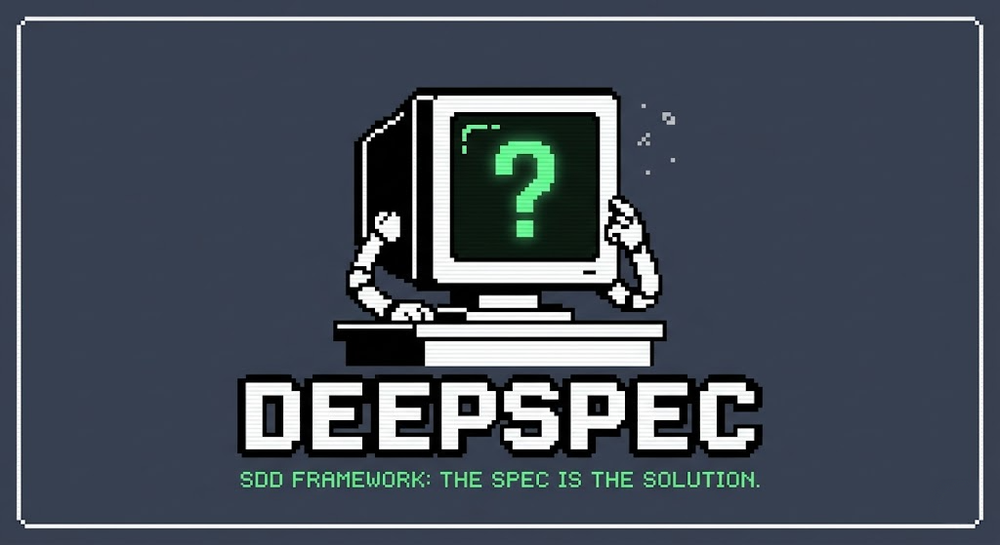

# DeepSpec

**SDD Framework: The Spec is the Solution.**

DeepSpec is a zero-ceremony, AI-native Spec-Driven Development (SDD) framework. It guides AI agents from intention to implementation using a strict 3-stage pipeline and the A-B-C documentation flow.

## Quick start

```bash
npx deep-spec init cursor-agent
```

Then in your agent:

1. `"Initialize DeepSpec"` — generate `AGENTS.md` from your repo
2. `"Create task [name]"` — draft A-B-C specs (no app code)
3. `"Approve task"` — implement with TDD in the same turn
4. Review at **Review Gate**, then `"Complete task"` to archive

## Pipeline

```
drafts/ → (Approve) → active/ → Review Gate → (Complete) → archive/
```

## A-B-C flow

| Doc                    | Role                                |
| ---------------------- | ----------------------------------- |
| `APPROACH.md`          | How — immutable execution plan      |
| `BUSINESS_CONTEXT.md`  | Why — acceptance criteria for TDD   |
| `COMPLETION_REPORT.md` | Evidence — status and execution log |

## Installation alternatives

**CLI (recommended):**

```bash
npx deep-spec init <agent>
```

Available agents: `cursor-agent`, `claude`, `copilot`, `opencode`, `cline`, and more — run `npx deep-spec --help`.

**Manual skill install (retrocompat):**

```bash
mkdir -p .cursor/skills/deep-spec
cp -R deep-spec/. .cursor/skills/deep-spec/
```

## Commands

| Command                          | Trigger                            |
| -------------------------------- | ---------------------------------- |
| `/deepspec.init`                 | Initialize DeepSpec                |
| `/deepspec.create-task`          | Create draft task                  |
| `/deepspec.approve-task`         | Approve + execute                  |
| `/deepspec.discard-task`         | Discard draft                      |
| `/deepspec.complete-task`        | Archive after Review Gate          |
| `/deepspec.revise-task`          | Review Rounds                      |
| `/deepspec.list`                 | List tasks by stage                |
| `/deepspec.repair`               | Repair tracking map                |
| `/deepspec.map-codebase`         | Refresh `AGENTS.md` from repo scan |
| `/deepspec.diagram-architecture` | Mermaid `ARCHITECTURE.md` per task |
| `/deepspec.interview`            | One-question approach refinement   |
| `/deepspec.answer-questions`     | Incorporate open-question answers  |

Optional per-task artifact: `ARCHITECTURE.md` (diagrams on demand). The VS Code extension shows **Execution Plan** progress from `APPROACH.md` reconciled with `COMPLETION_REPORT.md`.

## Repository layout (this repo)

```text
spec/commands/     # operational prompts
spec/templates/    # A-B-C templates
src/               # CLI + hooks (TypeScript)
deep-spec/         # orchestrator skill
.deepspec/         # dogfooded instance
```

## License

MIT — see [LICENSE](https://github.com/godrix/DeepSpec/blob/main/LICENSE).

Docs: [godrix.github.io/DeepSpec](https://godrix.github.io/DeepSpec/)
