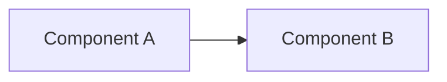

# Architecture — [name]

> Mermaid diagrams for this task. Optional — create via `/deepspec.diagram-architecture`.

## Context

<!-- One paragraph: scope of this task and what the diagrams explain. -->

## Diagrams

### Overview

## Legend

| Symbol | Meaning |
| ------ | ------- |
| …      | …       |

## References

| File      | Role |
| --------- | ---- |
| `src/...` | …    |

## Changelog

| Date       | Change          |
| ---------- | --------------- |
| YYYY-MM-DD | Initial diagram |
